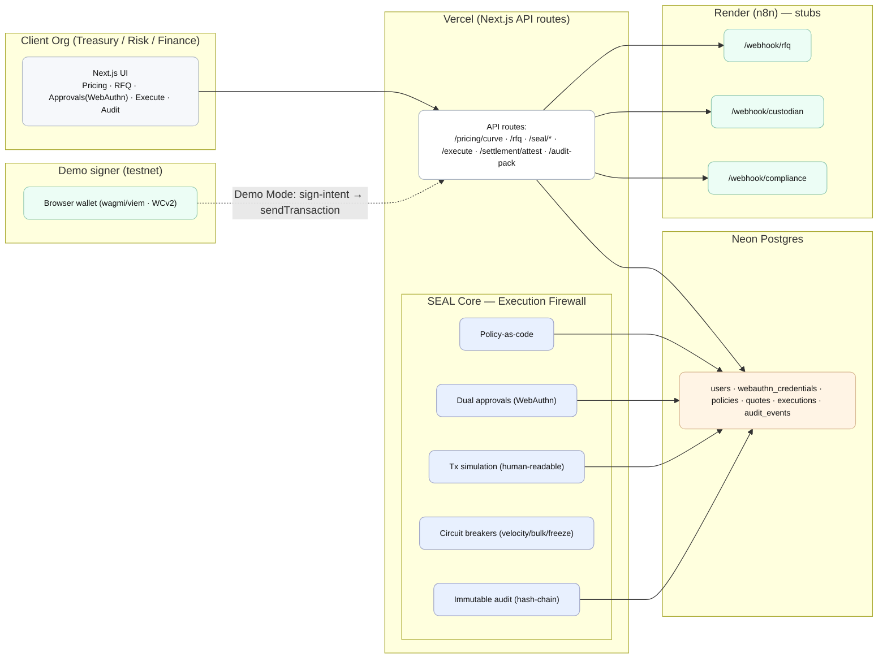

# Title & elevator pitch

**KustodyFi – SEAL-governed hedging & settlement orchestration (demo)**  
This repo is a working sketch of how we want SEAL to choreograph a hedge: publish a curve, collect real quotes, force two humans to approve, prove the transfer happened, and spit out an audit pack. Nothing fancy—just enough structure to show the moving parts and keep keys out of the server.

## Goals of this demo

- Walk through the entire lifecycle without ever parking a custody key on the backend.
- Require both Dealer and CFO passkeys before anything executable gets through.
- After settlement, bundle curve inputs, quotes, approvals, tx/bank refs, Travel-Rule stub, and the hash-chain digest into a single ZIP you could hand to an auditor.

## Cloud architecture (Mermaid diagram)

### Component responsibilities

- **Client** – The Next.js app handles login, passkey prompts, and showing curve/RFQ/approval data. It only calls API routes; it never stores quotes or secrets locally.
- **Vercel API routes** – These are the brain stem. Each handler validates input, runs SEAL logic, and records an audit event before responding.
- **SEAL core** – A bundle of modules for policy parsing, simulation output, WebAuthn verification, circuit-breaker math, and hash-chain logging.
- **Neon Postgres** – Holds users, WebAuthn credentials, policies, quotes, executions, and audit events. Every audit row stores a hash of the previous row.
- **Render/n8n** – Stub webhooks that stand in for banks, custodians, and compliance teams. They return deterministic JSON so the demo is repeatable.
- **Demo signer** – Optional wallet on a testnet. When demo mode is enabled, all execution flows stop at “sign this intent” and the wallet does the broadcast.

## Implementation plan (high level)

1. **Pricing** – Generate a theoretical curve from seeded FX/IR numbers. Tag it with a version, inputs, and timestamps.
2. **RFQ** – Call `/webhook/rfq` on n8n, persist every quote with expiry and show a countdown so it obviously expires.
3. **Policy check** – Policy is a JSON document (limits, counterparties, time windows, quorum). `/seal/policy-check` replays the rules and includes a human-readable trace explaining each pass/fail.
4. **Approvals** – Dealer and CFO complete WebAuthn challenges via `@simplewebauthn/server`. `/seal/approve` stores the attestation payloads and only flips `quorum_met` when both roles have signed.
5. **Execute** –  
   - Demo mode on: return a sign intent; the browser wallet signs and broadcasts on a testnet, returning `txHash`.  
   - Demo mode off: call `/webhook/custodian` and get a synthetic `txHash` plus optional bank reference.
6. **Attest settlement** – `/settlement/attest` binds `txHash`, `bankRef`, and a `trId` from the compliance webhook into both `executions` and `audit_events`.
7. **Audit pack** – `/audit-pack` streams a ZIP that contains the curve snapshot, quotes, approval proofs, settlement data, compliance receipt stub, CSV exports, and the full hash-chain ledger.

## Endpoints (contract)

| Method | Path | Purpose | Input → Output |
| --- | --- | --- | --- |
| GET | `/pricing/curve?pair=` | Fetch the current theoretical curve | → `{version, points[], inputs}` |
| POST | `/rfq` | Request quotes through n8n | `{pair, tenorDays, notionalUSD} → {rfqId, quotes[]}` |
| POST | `/seal/policy-check` | Evaluate policy + simulation | `{quote} → {ok, checks, simulation}` |
| POST | `/seal/approve` | Record a WebAuthn approval | `{actionId, webauthnProof} → {approvedBy, quorum}` |
| POST | `/execute` | Trigger execution once quorum is met | Demo on: `{signIntent}`; demo off: `{txHash, bankRef?}` |
| POST | `/settlement/attest` | Persist proof of settlement | `{execId, txHash, bankRef?, trId?} → OK` |
| GET | `/audit-pack?execId=` | Download the audit ZIP | → binary stream |

## Data model (minimal)

- `users` with `id`, `email`, and `role`.
- `webauthn_credentials` tied to each user (`credential_id`, `public_key`, `transports`).
- `policies` storing the currently active JSON blob plus version metadata.
- `quotes` keyed by RFQ, bank, quote ID, tenor, notional, forward rate, and expiry.
- `executions` linking a quote to quorum status, tx hash, and bank reference.
- `audit_events` with `(seq, prev_hash, event_type, payload, event_hash, created_at)` to form the ledger.

## Environment & deployment

- **Vercel**: set `DATABASE_URL` (Neon), `APP_BASE_URL` (for WebAuthn origin), `N8N_BASE_URL`, and `DEMO_MODE=true` (or false if you want to force custodian stubs).
- **Neon**: run the schema migration via Prisma or straight SQL, then copy the connection string into Vercel.
- **Render / n8n**: deploy a basic n8n project with three webhooks: `/webhook/rfq`, `/webhook/custodian`, `/webhook/compliance`. Keep responses deterministic so demos stay consistent.

## Security posture (demo)

- No private keys live on the server. Execution either routes to the browser wallet (testnet) or to a stub that represents the custodian.
- SEAL logic runs on every state change: policy evaluation, simulation, quorum tracking, circuit-breaker enforcement, and hash-chain logging. If anything is off, execution never unlocks.

## Quickstart

1. `pnpm install` and `pnpm dev` (or use npm). Visit `http://localhost:3000`.
2. Provision Neon + n8n, wire the env vars into `.env.local` / Vercel.
3. Register passkeys for a Dealer and CFO, run through pricing → RFQ → approvals → execute → audit pack, and confirm the ZIP contains all artifacts.

## Demo script (10 minutes)

1. Show the theoretical curve page and call out the version + inputs.
2. Kick off an RFQ, let the three quotes appear, and choose one before it expires.
3. Open the SEAL modal, review the policy check output, and approve as Dealer, then CFO.
4. Execute in demo mode so the wallet signs, or flip demo mode off and show the custodian webhook response.
5. Download the audit pack and walk through each artifact quickly.

## Roadmap (next)

- Swap the n8n stubs for real bank RFQ integrations and a Fireblocks/BitGo adapter.
- Anchor the daily audit hash to a public chain and layer in anomaly alerts so ops teams get nudged before something drifts.

## Appendix

- Keep a concrete policy JSON example in `src/lib/policy/example.json` (limits, whitelists, time windows, quorum, method allowlist) so tests and documentation match.
- The Mermaid block above can be pasted into internal docs or PlantUML if we need variants; label the “Demo signer (testnet)” clearly whenever we present so it’s not confused with production custody.
