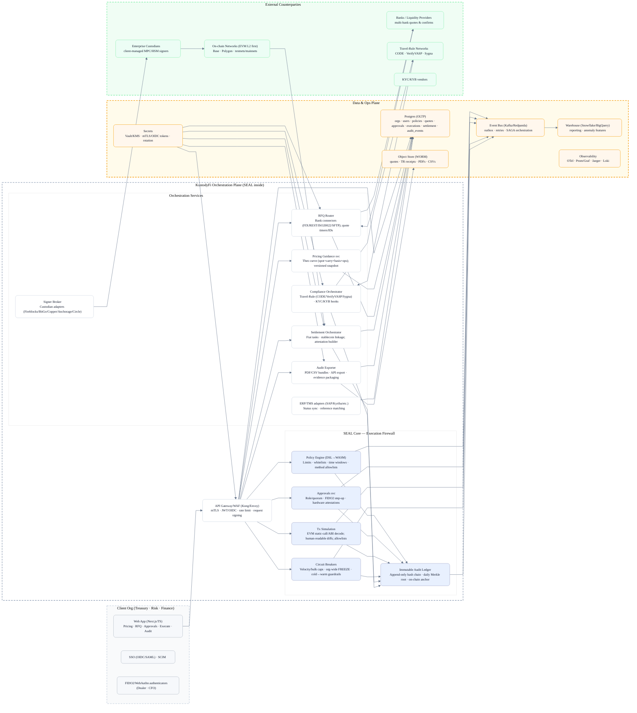
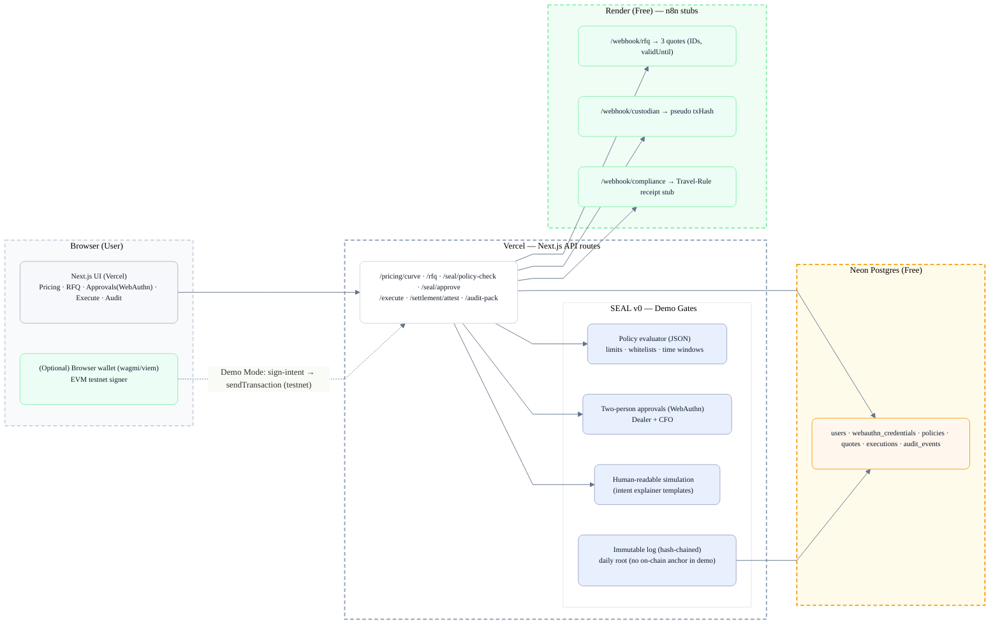

**KustodyFi – SEAL-governed hedging & settlement orchestration (demo)**  
This repo captures the minimal wiring we use to show how SEAL manages a hedge: price guidance, multi-bank RFQ, two-person approvals, execution, and proof. Everything stays keyless on the server and ends with an audit pack.

## Goals of Demo

- Prove the full lifecycle (pricing → RFQ → approvals → execute → attest → audit pack) without server-side private keys.
- Force Dealer + CFO passkeys before unlocking execution.
- Emit a ZIP that bundles curve inputs, quotes, approvals, tx/bank refs, Travel-Rule receipt stub, and the hash-chain digest.

## Architecture (Final Target)

The final product is a middle-layer orchestration with SEAL as the execution firewall. It integrates bank RFQ, enterprise custodians, Travel-Rule networks, and on-chain rails while producing a regulator-ready audit pack (quote→approvals→settlement proofs). Each block below addresses the incident patterns and competitor gaps we see in the field: policy-as-code plus dual approval to block insider pushes, simulation and circuit breakers to avoid fat-finger or velocity abuse, and unified audit outputs so ops/legal have a single source of truth.

### System Architecture (Mermaid)

## Demo Architecture (Vercel + Neon + n8n)

The hosted demo trims the system down to Vercel (Next.js) for the UI/API, Neon for storage, Render-hosted n8n for deterministic webhooks, and an optional browser wallet on an EVM testnet. We keep the same SEAL framing—policy-as-code, dual approvals, simulation, circuit breakers, Travel-Rule receipt stub, and unified audit packs—so the flow mirrors the final target even though the integrations are mocked.

### Component responsibilities

- **Client** – Next.js UI handles auth, passkey prompts, curve/RFQ views, approvals, and audit downloads. Everything dynamic comes from API routes.
- **API routes** – Each handler validates input, runs SEAL logic, and logs an audit event before responding.
- **SEAL core** – Modules for policy parsing, simulation output, WebAuthn verification, circuit breakers, and hash-chain logging.
- **Neon Postgres** – Ground truth for identities, policies, quotes, executions, and audit events.
- **Render / n8n** – Deterministic stubs that mimic banks, custodians, and compliance gateways so the demo can run end-to-end without external credentials.
- **Demo signer** – Optional testnet wallet. In demo mode we only return sign intents and rely on the browser wallet to broadcast.

## Implementation plan (high level)

1. **Pricing** – Seeded FX/IR inputs generate a theoretical curve. Store version + inputs for later.
2. **RFQ** – Call n8n `/webhook/rfq`, persist quotes with expiries, and show countdown timers.
3. **Policy check** – JSON policy defines limits, whitelists, time windows, and quorum. `/seal/policy-check` runs the rules and returns a readable trace.
4. **Approvals** – Dealer + CFO complete WebAuthn flows via `@simplewebauthn/server`; `/seal/approve` stores attestations and sets quorum.
5. **Execute** – Demo mode on: return sign intent → wallet signs/broadcasts → `txHash`. Demo mode off: call `/webhook/custodian` for a synthetic `txHash`/bank ref.
6. **Attest** – `/settlement/attest` ties `txHash`, `bankRef`, and compliance `trId` into `executions` and the audit ledger.
7. **Audit pack** – `/audit-pack` streams a ZIP with the curve snapshot, quotes, approvals, settlement data, TR receipt stub, CSVs, and hash-chain manifest.

## Endpoints (contract)

| Method | Path | Purpose | Input → Output |
| --- | --- | --- | --- |
| GET | `/pricing/curve?pair=` | Theoretical curve snapshot | → `{version, points[], inputs}` |
| POST | `/rfq` | Request quotes via n8n | `{pair, tenorDays, notionalUSD} → {rfqId, quotes[]}` |
| POST | `/seal/policy-check` | Evaluate policy rules | `{quote} → {ok, checks, simulation}` |
| POST | `/seal/approve` | Store a WebAuthn approval | `{actionId, webauthnProof} → {approvedBy, quorum}` |
| POST | `/execute` | Execute after quorum | Demo on: `{signIntent}`; demo off: `{txHash, bankRef?}` |
| POST | `/settlement/attest` | Persist settlement proof | `{execId, txHash, bankRef?, trId?} → OK` |
| GET | `/audit-pack?execId=` | Download artifacts | → ZIP stream |

## Data model (minimal)

- `users` (`id`, `email`, `role`).
- `webauthn_credentials` (`user_id`, `credential_id`, `public_key`, `transports`).
- `policies` (version metadata + JSON blob).
- `quotes` (`rfq_id`, `bank`, `quote_id`, `tenor_days`, `notional_usd`, `fwd`, `valid_until`).
- `executions` (`id`, `quote_id`, `approver_quorum`, `tx_hash`, `bank_ref`, `status`).
- `audit_events` (`seq`, `prev_hash`, `event_type`, `payload`, `event_hash`, `created_at`).

## Environment & deployment

- **Vercel**: `DATABASE_URL` (Neon), `APP_BASE_URL` (WebAuthn origin), `N8N_BASE_URL`, `DEMO_MODE=true`.
- **Neon**: apply the schema (Prisma or SQL), note the connection string.
- **Render / n8n**: deploy three webhooks—`/webhook/rfq`, `/webhook/custodian`, `/webhook/compliance`—with deterministic JSON payloads.

## Security posture

- Server stays keyless; execution either happens in the browser wallet (testnet) or via the custodian stub.
- SEAL evaluates every step (policy, simulation, approvals, circuit breakers) and logs to an append-only hash chain.

