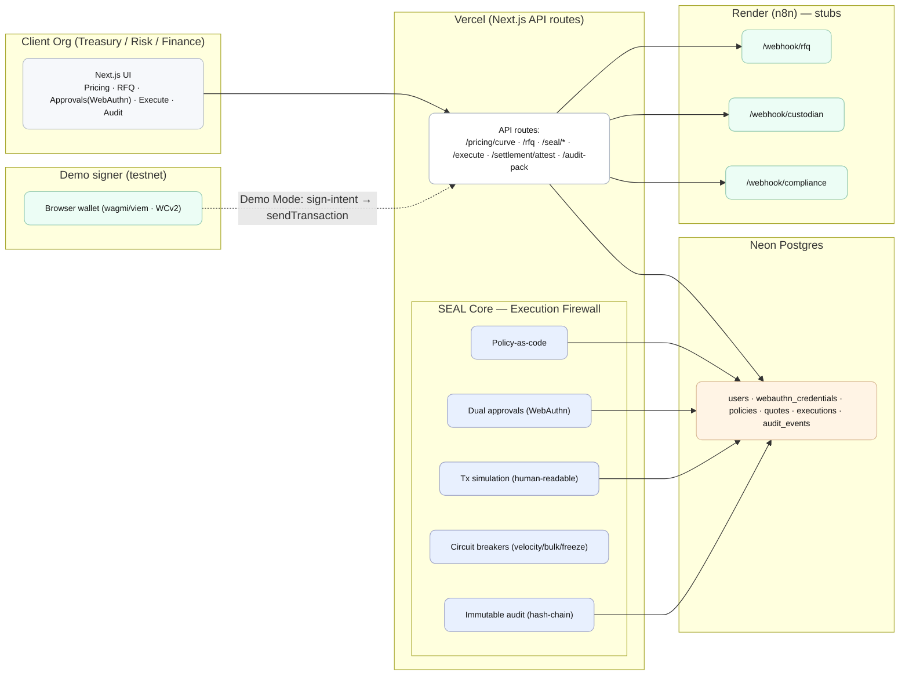

# Title & elevator pitch

**KustodyFi – SEAL-governed hedging & settlement orchestration (demo)**  
SEAL is the execution firewall enforcing policy-as-code, dual/multi-approval with WebAuthn, and immutable audit trails. This demo covers pricing guidance → multi-bank RFQ → SEAL approvals → custody/settlement attestation → audit pack while every transition is versioned, signed, and replayable.

## Goals of this demo

- Show end-to-end orchestration with no private keys on the server.
- Two approvals (Dealer + CFO) gate any execution.
- On completion, produce a ZIP audit pack (curve snapshot, quotes, approvals, tx/bank refs, Travel-Rule receipt stub, hash-chain summary).

## Cloud architecture (Mermaid diagram)

### Component responsibilities

- **Client Org boundary** – Next.js UI handles authentication (OIDC/SAML + passkeys), routes operators through pricing, RFQ intake, SEAL approval modal, execution, and audit download. No secrets or keys persist in the browser; state is fetched per step from API routes.
- **Vercel API layer** – App Router handlers expose the contract in the next section, enforce input validation, hydrate SEAL policy engine, and coordinate with Neon + n8n. Every handler writes structured audit events before responding.
- **SEAL Core** – Shared library used inside API routes. Policy-as-code module validates JSON policies, simulation renders human-readable diffs, approvals verify WebAuthn attestations and enforce quorum, circuit breakers track velocity/bulk thresholds, and the audit module hashes each event (prev_hash chaining).
- **Neon Postgres** – Source of truth for operators, WebAuthn credentials, policy versions, RFQ quotes, executions, and audit events. Row-level hashes are recomputed server-side to end up in `audit_events`.
- **Render / n8n stubs** – Deterministic workflows mimic downstream systems: `/webhook/rfq` returns mock quotes, `/webhook/custodian` fabricates settlement references, `/webhook/compliance` emits Travel-Rule receipt numbers. Swap these for production connectors later.
- **Demo signer** – Optional browser wallet on an EVM testnet. When Demo Mode is enabled, the API returns sign intents and expects the wallet to broadcast, keeping the server keyless.

## Implementation plan (high level)

1. **Pricing guidance** – compute a versioned theoretical curve from seeded FX/IR inputs and persist the inputs for audit.
2. **RFQ** – POST to Render-hosted n8n `/webhook/rfq`, persist `{bank, quoteId, fwd, validUntil}`, and display countdown timers per quote.
3. **SEAL policy** – JSON rules encode limits, whitelists, time windows, and quorum; `/seal/policy-check` returns `{ok, checks, simulation}` describing the path to approval.
4. **Approvals** – Dealer and CFO complete WebAuthn challenges via `@simplewebauthn/*`; `/seal/approve` stores attestations and only flips quorum once both roles are satisfied.
5. **Execute** –
   - Demo Mode **ON**: return a sign-intent, have browser wallet (wagmi/viem, WC v2) sign/send on testnet, capture `txHash`.
   - Demo Mode **OFF**: call n8n `/webhook/custodian`, receive a deterministic pseudo `txHash` + optional settlement reference.
6. **Attestation** – `/settlement/attest` links `txHash`, `bankRef`, and compliance `trId` into `executions` plus `audit_events`, extending the hash-chain.
7. **Audit Pack** – `/audit-pack` streams a ZIP (HTML→PDF summary, CSV exports, JSON artifacts, hash-chain manifest) for regulator hand-off.

## Endpoints (contract)

| Method | Path | Purpose | Input → Output |
| --- | --- | --- | --- |
| GET | `/pricing/curve?pair=` | Versioned theoretical curve | → `{version, points[], inputs}` |
| POST | `/rfq` | Request quotes via n8n | `{pair, tenorDays, notionalUSD} → {rfqId, quotes[]}` |
| POST | `/seal/policy-check` | Evaluate policy | `{quote} → {ok, checks, simulation}` |
| POST | `/seal/approve` | WebAuthn approval | `{actionId, webauthnProof} → {approvedBy, quorum}` |
| POST | `/execute` | Execute after quorum | Demo ON: `{signIntent}`; OFF: `{txHash, bankRef?}` |
| POST | `/settlement/attest` | Record proofs | `{execId, txHash, bankRef?, trId?} → OK` |
| GET | `/audit-pack?execId=` | Download evidence | → ZIP (PDF/CSV/JSON) |

## Data model (minimal)

- `users(id, email, role)`; `webauthn_credentials(user_id, credential_id, public_key, transports)`
- `policies(version, json)`
- `quotes(rfq_id, bank, quote_id, tenor_days, notional_usd, fwd, valid_until)`
- `executions(id, quote_id, approver_quorum, tx_hash, bank_ref, status)`
- `audit_events(seq, prev_hash, event_type, payload, event_hash, created_at)`

## Environment & deployment

- **Vercel** env vars: `DATABASE_URL` (Neon), `APP_BASE_URL` (WebAuthn origin), `N8N_BASE_URL` (Render), `DEMO_MODE=true`.
- **Neon**: apply schema migration (Prisma/SQL) to provision the tables above.
- **Render (n8n)**: host deterministic flows for `/webhook/rfq`, `/webhook/custodian`, `/webhook/compliance`.

## Security posture (demo)

- Keyless: the server never holds private keys; signing occurs in the browser (testnet) or via the custodian stub.
- SEAL gates every state change (policy evaluation, dual approvals, simulation, circuit breakers) and emits an immutable hash-chain audit trail.

## Quickstart

1. Local: `pnpm dev` (or `npm run dev`) and open `http://localhost:3000`.
2. Provision: connect repo to Vercel, create Neon database, deploy Render n8n instance.
3. Register Dealer/CFO passkeys, run Pricing → RFQ → Approvals → Execute → Audit Pack.

## Demo script (10 minutes)

1. Show theoretical curve (version + seeded inputs).
2. Fire RFQ; present three quotes with expiries and select the target bank.
3. Walk through SEAL modal: policy results, simulation trace, Dealer + CFO WebAuthn approvals.
4. Execute: Demo Mode wallet signs and returns `txHash` (or custodian stub response).
5. Download Audit Pack ZIP; highlight curve snapshot, raw quotes, approvals, tx/bank ref, Travel-Rule receipt stub, hash-chain summary.

## Roadmap (next)

- Replace n8n stubs with real bank RFQ connectors and Fireblocks/BitGo adapters.
- Anchor daily audit Merkle roots on-chain and surface anomaly-detection insights (AI assist).

## Appendix

- Provide a policy JSON example covering limits, whitelists, time windows, quorum, and method allowlists.
- Reuse the Mermaid block above (and optional PlantUML) for internal docs; clarify "Demo signer (testnet)" label to avoid product confusion.
